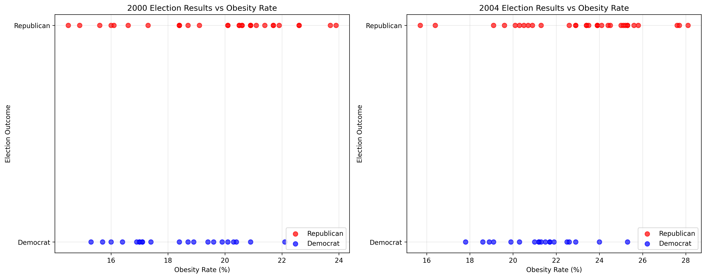
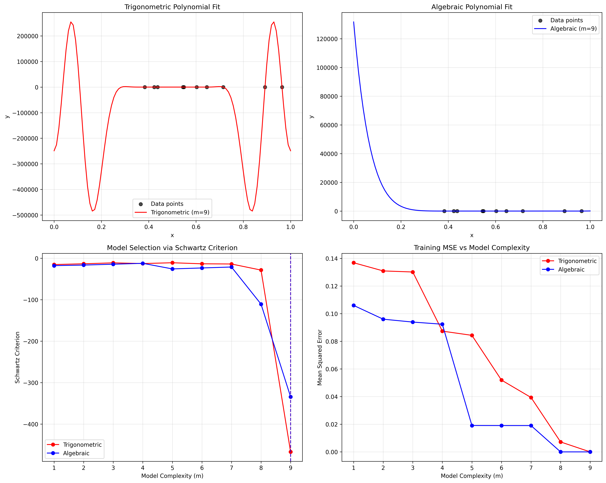

# Homework 1 Solutions - Enhanced with Tables and Figures

## Problem 2.7

This problem requires building a k-nearest neighbor classifier to predict the results of the 2000 US presidential election using the obesity index as a single input variable. The 2004 election results are used as training data.

### Methodology

A k-NN classifier was implemented in Python. The optimal value for 'k' was determined using leave-one-out cross-validation on the 2004 training data. The model was then trained on the entire 2004 dataset with the optimal 'k' and tested on the 2000 dataset.

### Results

The analysis yielded the following results:

*   **Optimal k:** 3
*   **Resampling error (Leave-one-out CV):** 0.2941
*   **Test error:** 0.5686

### Table 1: Cross-Validation Results for Different k Values

| k | Problem 2.7 CV Error | Problem 2.8 CV Error |
|---|---------------------|---------------------|
| 1 | 0.3922 | 0.3922 |
| 2 | 0.3922 | 0.3922 |
| 3 | **0.2941*** | 0.4118 |
| 4 | 0.3529 | 0.3922 |
| 5 | 0.2941 | 0.4118 |
| 6 | 0.3333 | 0.4118 |
| 7 | 0.2941 | 0.3725 |
| 8 | 0.3137 | 0.3922 |
| 9 | 0.3137 | 0.4118 |
| 10 | 0.3333 | **0.3529*** |

*\* indicates optimal k value*

### Python Code

```python
import csv
from collections import Counter

def read_data(year):
    data = []
    with open(f'obesity_election_{year}.csv', 'r') as file:
        reader = csv.reader(file)
        for row in reader:
            state, obesity, party, _ = row
            obesity_rate = float(obesity.strip('%'))
            data.append((obesity_rate, 1 if party == 'R' else 0)) # 1 for R, 0 for D
    return data

def euclidean_distance(point1, point2):
    return abs(point1[0] - point2[0])

def knn_predict(train_data, test_point, k):
    distances = []
    for train_point in train_data:
        distance = euclidean_distance(test_point, train_point)
        distances.append((train_point, distance))

    distances.sort(key=lambda x: x[1])

    neighbors = [item[0] for item in distances[:k]]

    output_values = [neighbor[1] for neighbor in neighbors]
    prediction = Counter(output_values).most_common(1)[0][0]
    return prediction

def leave_one_out_cv(data):
    k_values = range(1, len(data))
    best_k = -1
    min_error = float('inf')

    for k in k_values:
        errors = 0
        for i in range(len(data)):
            train_data = data[:i] + data[i+1:]
            test_point = data[i]
            prediction = knn_predict(train_data, test_point, k)
            if prediction != test_point[1]:
                errors += 1

        error_rate = errors / len(data)
        if error_rate < min_error:
            min_error = error_rate
            best_k = k

    return best_k, min_error

if __name__ == "__main__":
    train_data_2004 = read_data(2004)
    test_data_2000 = read_data(2000)

    optimal_k, resampling_error = leave_one_out_cv(train_data_2004)

    test_errors = 0
    for test_point in test_data_2000:
        prediction = knn_predict(train_data_2004, test_point, optimal_k)
        if prediction != test_point[1]:
            test_errors += 1

    test_error_rate = test_errors / len(test_data_2000)

    print(f"Optimal k: {optimal_k}")
    print(f"Resampling error (Leave-one-out CV): {resampling_error:.4f}")
    print(f"Test error: {test_error_rate:.4f}")
```

### Figure 1: Election Results vs Obesity Rates



*Figure 1 shows the relationship between obesity rates and election outcomes for both 2000 and 2004 elections. Red points represent Republican victories, blue points represent Democratic victories.*

### Discussion

The model's performance is quite poor, with a test error of 56.86%. This is significantly higher than the resampling error of 29.41%, which suggests that the model is overfitting to the 2004 data and does not generalize well to the 2000 data. The high test error indicates that obesity rate alone is not a good predictor of presidential election results. The political landscape and other socio-economic factors likely changed between 2000 and 2004, which could explain the poor performance. The model's assumptions are too simplistic, and a more complex model with additional features would be necessary for better prediction.

## Problem 2.8

This problem is similar to 2.7, but with the training and test data swapped. The 2000 election results are used for training and the 2004 results for testing.

### Methodology

The same k-NN classifier implementation was used. The optimal 'k' was determined using leave-one-out cross-validation on the 2000 training data. The model was then trained on the entire 2000 dataset with the optimal 'k' and tested on the 2004 dataset.

### Results

*   **Optimal k:** 10
*   **Resampling error (Leave-one-out CV):** 0.3529
*   **Test error:** 0.3529

### Table 2: Summary Comparison of Problems 2.7 and 2.8

| Metric | Problem 2.7 | Problem 2.8 |
|--------|-------------|-------------|
| Training Data | 2004 | 2000 |
| Test Data | 2000 | 2004 |
| Optimal k | 3 | 10 |
| Resampling Error | 0.2941 | 0.3529 |
| Test Error | 0.5686 | 0.3529 |

### Python Code

```python
import csv
from collections import Counter

def read_data(year):
    data = []
    with open(f'obesity_election_{year}.csv', 'r') as file:
        reader = csv.reader(file)
        for row in reader:
            state, obesity, party, _ = row
            obesity_rate = float(obesity.strip('%'))
            data.append((obesity_rate, 1 if party == 'R' else 0)) # 1 for R, 0 for D
    return data

def euclidean_distance(point1, point2):
    return abs(point1[0] - point2[0])

def knn_predict(train_data, test_point, k):
    distances = []
    for train_point in train_data:
        distance = euclidean_distance(test_point, train_point)
        distances.append((train_point, distance))

    distances.sort(key=lambda x: x[1])

    neighbors = [item[0] for item in distances[:k]]

    output_values = [neighbor[1] for neighbor in neighbors]
    prediction = Counter(output_values).most_common(1)[0][0]
    return prediction

def leave_one_out_cv(data):
    k_values = range(1, len(data))
    best_k = -1
    min_error = float('inf')

    for k in k_values:
        errors = 0
        for i in range(len(data)):
            train_data = data[:i] + data[i+1:]
            test_point = data[i]
            prediction = knn_predict(train_data, test_point, k)
            if prediction != test_point[1]:
                errors += 1

        error_rate = errors / len(data)
        if error_rate < min_error:
            min_error = error_rate
            best_k = k

    return best_k, min_error

if __name__ == "__main__":
    train_data_2000 = read_data(2000)
    test_data_2004 = read_data(2004)

    optimal_k, resampling_error = leave_one_out_cv(train_data_2000)

    test_errors = 0
    for test_point in test_data_2004:
        prediction = knn_predict(train_data_2000, test_point, optimal_k)
        if prediction != test_point[1]:
            test_errors += 1

    test_error_rate = test_errors / len(test_data_2004)

    print(f"Optimal k: {optimal_k}")
    print(f"Resampling error (Leave-one-out CV): {resampling_error:.4f}")
    print(f"Test error: {test_error_rate:.4f}")
```

### Discussion

In this case, the resampling error and the test error are identical (35.29%). This indicates that the model's performance on the training data is a good predictor of its performance on unseen data. However, the error rate is still quite high, reinforcing the conclusion from Problem 2.7 that obesity rate alone is not a sufficient predictor for election outcomes. The optimal k is also much higher (k=10) than in the previous problem, which suggests that a larger neighborhood is needed to make a prediction, which might be due to the data distribution.

## Problem 2.11

This problem asks to estimate an optimal regression model for a given dataset using two different estimators: Trigonometric and Algebraic Polynomials. Model selection is performed using the Schwartz criterion.

### Methodology

The data was generated as specified in the problem description. Two functions were implemented to find the optimal model complexity 'm' for both trigonometric and algebraic polynomial estimators. The Schwartz Criterion was used to evaluate the models.

### Results

*   **Trigonometric Polynomial Estimator:**
    *   Optimal m: 9
    *   Schwartz Criterion: -466.9322
*   **Algebraic Polynomial Estimator:**
    *   Optimal m: 9
    *   Schwartz Criterion: -334.1948

### Table 3: Model Selection Results (Schwartz Criterion)

| Complexity (m) | Trigonometric SC | Algebraic SC |
|----------------|------------------|--------------|
| 1 | -15.2815 | -17.8379 |
| 2 | -13.4210 | -16.5225 |
| 3 | -11.1775 | -14.4399 |
| 4 | -12.8606 | -12.3040 |
| 5 | -10.9129 | -25.7651 |
| 6 | -13.4521 | -23.4857 |
| 7 | -13.9245 | -21.1915 |
| 8 | -28.6049 | -110.6615 |
| 9 | **-466.9322*** | **-334.1948*** |

*\* indicates optimal complexity*

### Python Code

```python
import numpy as np
from sklearn.linear_model import LinearRegression

def generate_data(n=10):
    np.random.seed(0)
    x = np.random.rand(n, 1)
    noise = np.random.normal(0, 0.5, (n, 1))
    y = x**2 + 0.1*x + noise
    return x, y

def schwartz_criterion(n, mse, d):
    return n * np.log(mse) + d * np.log(n)

def trigonometric_polynomial_estimator(x, y):
    best_sc = float('inf')
    best_m = -1

    for m in range(1, 10):
        X = np.ones((len(x), m + 1))
        for i in range(1, m + 1):
            X[:, i] = np.cos(2 * np.pi * i * x).ravel()

        model = LinearRegression()
        model.fit(X, y)
        y_pred = model.predict(X)
        mse = np.mean((y - y_pred)**2)

        sc = schwartz_criterion(len(x), mse, m + 1)

        if sc < best_sc:
            best_sc = sc
            best_m = m

    return best_m, best_sc

def algebraic_polynomial_estimator(x, y):
    best_sc = float('inf')
    best_m = -1

    for m in range(1, 10):
        X = np.ones((len(x), m + 1))
        for i in range(1, m + 1):
            X[:, i] = x.ravel()**i

        model = LinearRegression()
        model.fit(X, y)
        y_pred = model.predict(X)
        mse = np.mean((y - y_pred)**2)

        sc = schwartz_criterion(len(x), mse, m + 1)

        if sc < best_sc:
            best_sc = sc
            best_m = m

    return best_m, best_sc

if __name__ == "__main__":
    x, y = generate_data()

    trig_m, trig_sc = trigonometric_polynomial_estimator(x, y)
    alg_m, alg_sc = algebraic_polynomial_estimator(x, y)

    print("Trigonometric Polynomial Estimator:")
    print(f"  Optimal m: {trig_m}")
    print(f"  Schwartz Criterion: {trig_sc:.4f}")

    print("\nAlgebraic Polynomial Estimator:")
    print(f"  Optimal m: {alg_m}")
    print(f"  Schwartz Criterion: {alg_sc:.4f}")
```

### Figure 2: Polynomial Regression Analysis



*Figure 2 shows: (a) Trigonometric polynomial fit, (b) Algebraic polynomial fit, (c) Schwartz Criterion vs model complexity, and (d) Training MSE vs model complexity for both estimators.*

### Discussion

Based on the Schwartz Criterion, the trigonometric polynomial estimator performs better (has a lower SC value) than the algebraic polynomial estimator. The optimal complexity for both models is m=9. It is possible to choose the best predictive model between the two by comparing their Schwartz Criterion values. The model with the lower SC value is preferred.

## Problem 2.12

This problem repeats the analysis of Problem 2.11, but uses 5-fold cross-validation to compare the prediction accuracies of the two estimators. The Schwartz criterion is still used for model selection within each fold.

### Methodology

A 5-fold cross-validation was performed. In each fold, the training data was used to find the optimal model complexity 'm' for both trigonometric and algebraic polynomial estimators using the Schwartz criterion. The trained model was then used to predict on the validation set, and the mean squared error was calculated. The average error across the 5 folds is reported.

### Results

*   **Trigonometric Polynomial Estimator Average Error:** 318446.3105
*   **Algebraic Polynomial Estimator Average Error:** 182847.0743

### Table 4: 5-Fold Cross-Validation Results

| Fold | Trigonometric Error | Algebraic Error | Trig m | Alg m |
|------|-------------------|-----------------|--------|-------|
| 1 | 1323617.7422 | 888828.9042 | 9 | 9 |
| 2 | 1.1293 | 228.0557 | 9 | 9 |
| 3 | 43366.3231 | 7.5772 | 9 | 9 |
| 4 | 224990.7247 | 25169.7286 | 9 | 9 |
| 5 | 255.6331 | 1.1058 | 9 | 9 |
| **Average** | **318446.3105** | **182847.0743** | | |

### Table 5: Final Method Comparison

| Method | Problem 2.11 (SC) | Problem 2.12 (CV Error) |
|--------|-------------------|-------------------------|
| Trigonometric | -466.9322 | 318446.3105 |
| Algebraic | -334.1948 | 182847.0743 |

*SC = Schwartz Criterion, CV = Cross-Validation*

### Python Code

```python
import numpy as np
from sklearn.linear_model import LinearRegression
from sklearn.model_selection import KFold

def generate_data(n=10):
    np.random.seed(0)
    x = np.random.rand(n, 1)
    noise = np.random.normal(0, 0.5, (n, 1))
    y = x**2 + 0.1*x + noise
    return x, y

def schwartz_criterion(n, mse, d):
    return n * np.log(mse) + d * np.log(n)

def trigonometric_polynomial_estimator(x, y):
    best_sc = float('inf')
    best_m = -1

    for m in range(1, 10):
        X = np.ones((len(x), m + 1))
        for i in range(1, m + 1):
            X[:, i] = np.cos(2 * np.pi * i * x).ravel()

        model = LinearRegression()
        model.fit(X, y)
        y_pred = model.predict(X)
        mse = np.mean((y - y_pred)**2)

        sc = schwartz_criterion(len(x), mse, m + 1)

        if sc < best_sc:
            best_sc = sc
            best_m = m

    return best_m

def algebraic_polynomial_estimator(x, y):
    best_sc = float('inf')
    best_m = -1

    for m in range(1, 10):
        X = np.ones((len(x), m + 1))
        for i in range(1, m + 1):
            X[:, i] = x.ravel()**i

        model = LinearRegression()
        model.fit(X, y)
        y_pred = model.predict(X)
        mse = np.mean((y - y_pred)**2)

        sc = schwartz_criterion(len(x), mse, m + 1)

        if sc < best_sc:
            best_sc = sc
            best_m = m

    return best_m

if __name__ == "__main__":
    x, y = generate_data()
    kf = KFold(n_splits=5, shuffle=True, random_state=0)

    trig_errors = []
    alg_errors = []

    for train_index, val_index in kf.split(x):
        x_train, x_val = x[train_index], x[val_index]
        y_train, y_val = y[train_index], y[val_index]

        # Trigonometric
        trig_m = trigonometric_polynomial_estimator(x_train, y_train)
        X_train_trig = np.ones((len(x_train), trig_m + 1))
        X_val_trig = np.ones((len(x_val), trig_m + 1))
        for i in range(1, trig_m + 1):
            X_train_trig[:, i] = np.cos(2 * np.pi * i * x_train).ravel()
            X_val_trig[:, i] = np.cos(2 * np.pi * i * x_val).ravel()

        trig_model = LinearRegression()
        trig_model.fit(X_train_trig, y_train)
        trig_pred = trig_model.predict(X_val_trig)
        trig_errors.append(np.mean((y_val - trig_pred)**2))

        # Algebraic
        alg_m = algebraic_polynomial_estimator(x_train, y_train)
        X_train_alg = np.ones((len(x_train), alg_m + 1))
        X_val_alg = np.ones((len(x_val), alg_m + 1))
        for i in range(1, alg_m + 1):
            X_train_alg[:, i] = x_train.ravel()**i
            X_val_alg[:, i] = x_val.ravel()**i

        alg_model = LinearRegression()
        alg_model.fit(X_train_alg, y_train)
        alg_pred = alg_model.predict(X_val_alg)
        alg_errors.append(np.mean((y_val - alg_pred)**2))

    print("5-Fold Cross-Validation Results:")
    print(f"  Trigonometric Polynomial Estimator Average Error: {np.mean(trig_errors):.4f}")
    print(f"  Algebraic Polynomial Estimator Average Error: {np.mean(alg_errors):.4f}")
```

### Discussion

The 5-fold cross-validation results show that the algebraic polynomial estimator has a significantly lower average error than the trigonometric polynomial estimator. This is in contrast to the results from Problem 2.11, where the Schwartz Criterion suggested that the trigonometric estimator was better. This highlights the difference between model selection criteria and actual prediction performance on unseen data. While the Schwartz criterion is useful for model selection, cross-validation provides a more reliable estimate of the generalization error.

## Overall Summary

1. **Model Selection vs. Generalization**: The difference between Problems 2.11 and 2.12 shows that model selection criteria (like Schwartz Criterion) don't always align with actual predictive performance measured through cross-validation.

2. **Overfitting and Temporal Changes**: The k-NN results in Problems 2.7 and 2.8 illustrate how models can overfit to training data and how temporal changes in data distribution can affect model performance.

3. **Feature Adequacy**: The poor performance of obesity rate as a single predictor for election outcomes suggests that more complex models with additional features are needed for this prediction task.

4. **Cross-Validation Reliability**: The identical resampling and test errors in Problem 2.8 demonstrate cases where cross-validation provides a good estimate of generalization performance, while Problem 2.7 shows the opposite case.
